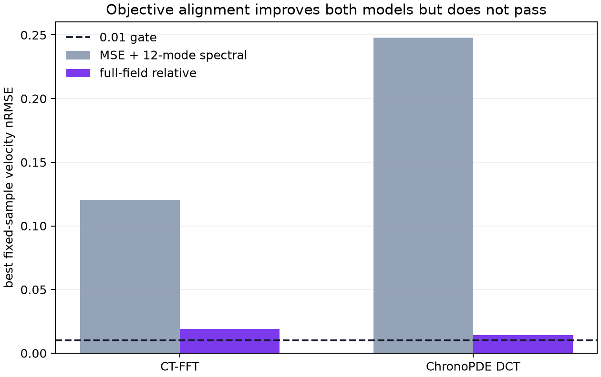
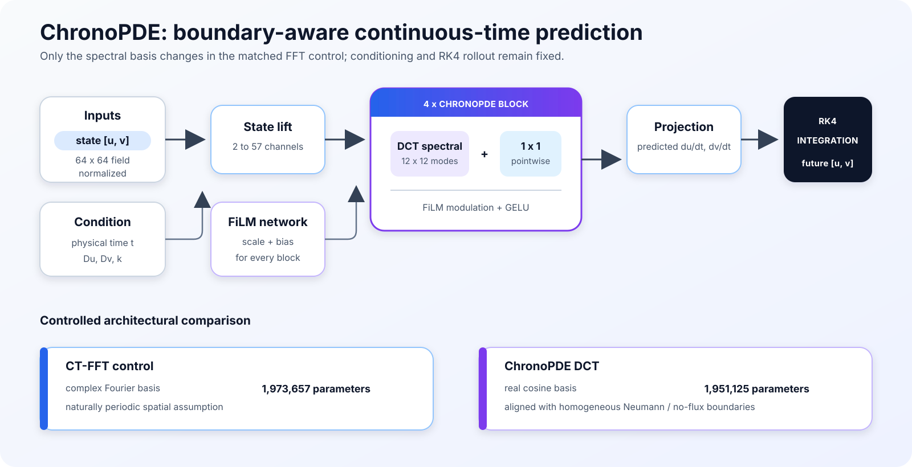
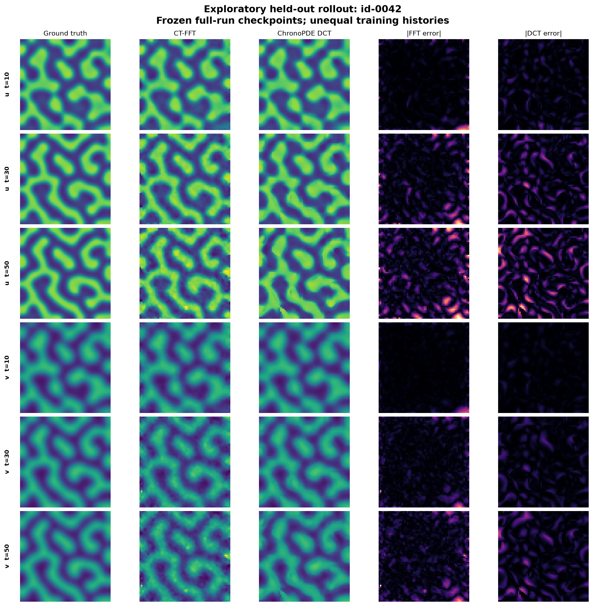

# ChronoPDE

ChronoPDE investigates whether a cosine spectral neural operator matched to
homogeneous Neumann boundary conditions improves continuous-time PDE modeling
over a parameter-matched FFT control. The project covers deterministic PDE data
generation, learned velocity fields, RK4 rollout, and reproducible failure
analysis in PyTorch.

> **Headline result:** objective alignment reduced the DCT model's fixed-sample
> velocity nRMSE from **0.2480 to 0.01421**, compared with **0.1205 to 0.01895**
> for CT-FFT. DCT was lower-error on **16/16 matched diagnostic samples**, but
> neither model passed the predefined **0.01 gate**.



## Motivation

Fourier neural operators are naturally periodic, while this reaction-diffusion
system uses homogeneous Neumann, or no-flux, boundaries. ChronoPDE tests a
specific architectural hypothesis: does replacing the Fourier basis with a
real cosine basis improve a continuous-time neural operator when everything
else is held as constant as possible?

The project used predefined gates. When the final Week 6 gate failed, later
sparse-time and out-of-distribution experiments stopped rather than changing
the threshold after observing the result.

## Method and architecture

Both continuous-time models receive a normalized two-channel state, physical
time, and three PDE parameters. A FiLM network conditions four spectral blocks.
The model predicts the instantaneous velocity, and fixed-step RK4 integrates it
to future states. The controlled difference is the spatial spectral basis.



| Component | CT-FFT control | ChronoPDE DCT |
| --- | --- | --- |
| Spectral basis | Complex Fourier modes | Real orthonormal cosine modes |
| Boundary assumption | Periodic | Homogeneous Neumann / no-flux |
| Retained modes | 12 x 12 | 12 x 12 |
| Parameters | 1,973,657 | 1,951,125 |
| Conditioning | Time and `[Du, Dv, k]` through FiLM | Same |
| Rollout | Fixed-step RK4 | Same |

The repository also includes residual U-Net and autoregressive FFT-FNO
baselines, quintic spline velocity targets, and shared evaluation metrics.

## Dataset

- 720 deterministic trajectories of a two-species, parameterized 2D
  reaction-diffusion system.
- State layout: `[trajectory, time, channel, 64, 64]`.
- 101 stored states over physical time `[0, 50]`.
- Frozen train, validation, ID, parameter-OOD, and initial-condition-OOD splits.
- Full, irregular-50%, and irregular-25% temporal masks.
- Normalization fitted only on the training split.

The raw HDF5 dataset is intentionally excluded from Git. Its frozen SHA-256 is
recorded in the evidence and figure provenance.

## Experiments and results

The decisive diagnostic used seed 0, the same 16 samples from four trajectories,
batch size 16, no spline perturbation, constant learning rate `3e-4`, no weight
decay, and 5,000 optimizer steps. The aligned objective directly minimized
per-sample full-field relative velocity error.

| Model | Original objective nRMSE | Aligned objective nRMSE | 0.01 gate |
| --- | ---: | ---: | :---: |
| CT-FFT | 0.1205 | 0.01895 | Fail |
| ChronoPDE DCT | 0.2480 | **0.01421** | Fail |

Both models exceeded the required 1,000x optimization-loss reduction. DCT had
lower velocity nRMSE for every matched identity; the paired mean DCT-minus-FFT
difference was `-0.00503`, with a deterministic 10,000-resample bootstrap 95%
interval of `[-0.00668, -0.00354]`. This is a fixed diagnostic result, not a
multi-seed generalization claim.

## What went wrong?

The original objective combined global MSE with relative error in only the
lowest 12 x 12 spectral modes. High-energy samples therefore had greater
influence, while the gate weighted each sample through its own full-field target
energy. Aligning the objective with the gate improved both models dramatically,
showing that loss-metric mismatch was real.

It did not fully explain the failure. The CPU target audit found finite targets
and a median spline-to-PDE velocity nRMSE of `0.00151`, far below the repair
threshold. After the complete aligned budget, both backbones still remained
above `0.01`. The declared route was therefore to document a model or
conditioning limitation and stop the study.

## Exploratory held-out rollout

The following visualization replays existing frozen ID checkpoints on
`id-0042`, selected deterministically as the trajectory nearest the median
combined error rank. It is qualitative context only: CT-FFT trained for 150
epochs while DCT stopped after 85, so it is not a confirmatory comparison.



The companion [figure provenance](figures/qualitative_rollout.json) records the
dataset, checkpoint hashes, source commits, selection rule, time indices, and
per-channel errors.

## Reproduce the main result

The headline result can be recomputed from committed lightweight evidence on a
CPU without the dataset, checkpoints, GPU, Kaggle, or Internet:

```bash
python3.11 -m venv .venv
source .venv/bin/activate
python -m pip install -e ".[dev]"
python scripts/reproduce_diagnostic.py --model both
```

Expected core output:

```text
CT-FFT
  Best step: 4100
  Median velocity nRMSE: 0.01895
  Gate: 0.01000
  Result: FAIL

ChronoPDE DCT
  Best step: 5000
  Median velocity nRMSE: 0.01421
  Gate: 0.01000
  Result: FAIL

Matched samples: DCT lower error on 16 / 16
```

Use `--format json` for machine-readable output and `--archive-root PATH` to
verify all seven original Kaggle archives byte-for-byte. Full dataset,
training, evaluation, figure-generation, and Kaggle instructions are in the
[reproduction guide](docs/REPRODUCTION.md).

## Repository structure

```text
ChronoPDE/
├── chronopde/         # data, models, numerics, training, evaluation, diagnostics
├── configs/           # frozen experiment and dataset configuration
├── scripts/           # generation, training, evaluation, and reproduction CLIs
├── tests/             # numerical, model, CLI, and evidence contracts
├── figures/           # public architecture and qualitative figures
├── reports/           # lightweight scientific evidence and generated analysis
├── notebooks/         # canonical Kaggle workflow plus archived provenance
├── demo/              # offline Streamlit evidence explorer
├── docs/              # method, roadmap, reproduction, and portfolio notes
└── output/pdf/        # controlled study and failure-analysis report
```

## Limitations and claim boundary

- The aligned comparison uses one seed and 16 fixed development samples.
- The held-out rollout figure uses unequal exploratory training histories.
- Sparse-time, hidden-time, parameter-OOD, and initial-condition-OOD claims were
  not evaluated after the stop rule fired.
- The result supports an objective-alignment finding and a matched diagnostic
  DCT advantage; it does not establish general DCT superiority.
- Checkpoints are research artifacts, not validated scientific simulators.

See the [model card](MODEL_CARD.md),
[experimental report](output/pdf/chronopde_negative_result_report.pdf),
[release record](docs/RELEASE.md), and [portfolio summary](docs/PORTFOLIO.md).

The additive [ChronoPDE V2 Phase 1 evidence audit](reports/chronopde_v2/phase1/README.md)
records claim-level errata and provenance without changing the frozen study.

The [ChronoPDE V2 Phase 2 numerical audit](reports/chronopde_v2/phase2/README.md)
validates the discrete Neumann operator, freezes exact-RHS supervision and fresh
split identities, and records a successful CPU pilot without making a new model
quality claim.

The [ChronoPDE V2 Phase 3 data report](reports/chronopde_v2/phase3/README.md)
records a validated 512-trajectory training and 128-trajectory validation
dataset with exact discrete-RHS labels. The 256 confirmatory identities remain
sealed and ungenerated.

The [Phase 4 feasibility protocol](reports/chronopde_v2/phase4/README.md)
implements matched FFT-12 and DCT-24 training on that development dataset,
including deterministic resume, validation-only selection, and verified
recovery packages. It is implementation-complete but scientifically pending a
real GPU run; no new model-quality claim is made here.

## License and attribution

ChronoPDE is released under the [MIT License](LICENSE). The implementation is
independent; PDEBench reference fixtures are used only for numerical comparison.
